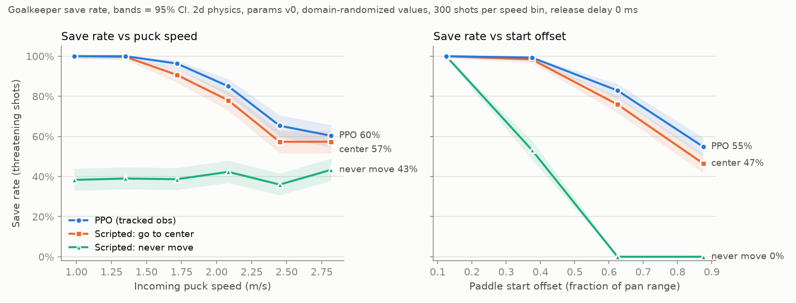
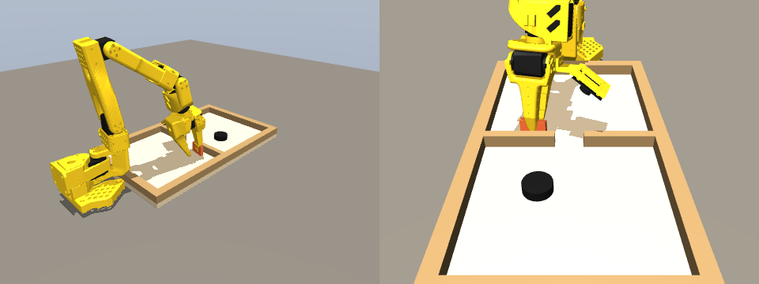
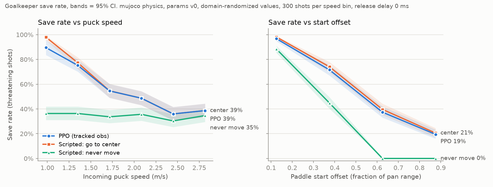
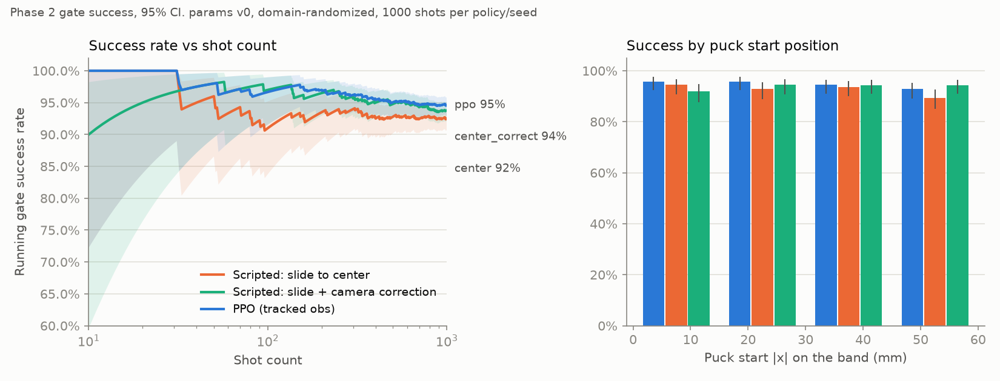
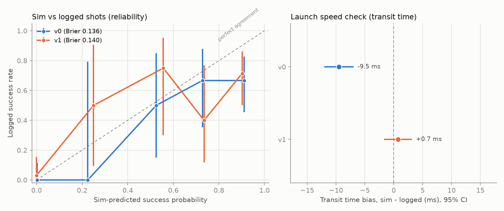
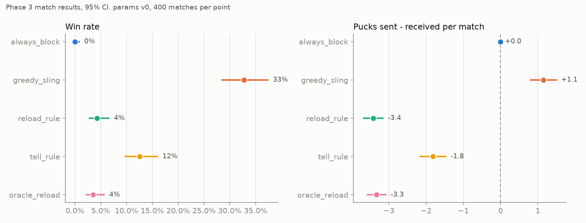
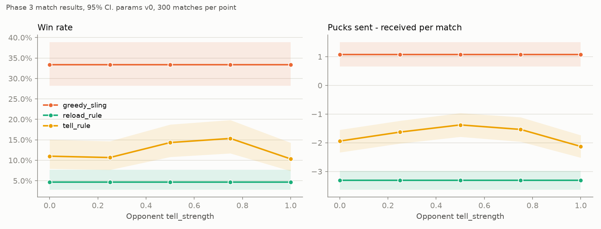

# slingpuck

Sim2real2sim reinforcement-learning pipeline for an **SO-101 arm** (6-DOF,
LeRobot-compatible, Feetech STS3215 servos) that plays tabletop **sling puck**
on a **moopok Fast Sling Puck board, size M**. Deployment inference must run on
a Jetson Orin Nano.

The project has three phases:

| Phase | Task | Control variable |
|---|---|---|
| 1. Goalkeeper | A paddle on the arm blocks pucks that come through the center gate. | Pan joint target |
| 2. Targeted shot | The arm hooks the puck with a passive slip-release end effector, pulls back, and releases it through the gate. | Strike angle and pull-back distance |
| 3. Adversarial | A high-level policy chooses **block**, **sling** or **hold** against an opponent. Research question: *when is it safe to commit to a sling?* | Discrete selector over frozen primitives |

---

## Contents

1. [Status](#status)
2. [Setup](#setup)
3. [Quick start](#quick-start)
4. [Repository layout](#repository-layout)
5. [Board frame and geometry](#board-frame-and-geometry)
6. [Configs and parameter versioning](#configs-and-parameter-versioning)
7. [Physics and sensing models](#physics-and-sensing-models)
8. [Phase 1: goalkeeper](#phase-1-goalkeeper)
9. [MuJoCo simulation](#mujoco-simulation)
10. [Phase 2: targeted shot](#phase-2-targeted-shot)
11. [System identification (sim2real2sim)](#system-identification-sim2real2sim)
12. [Phase 3: match against an opponent](#phase-3-match-against-an-opponent)
13. [Tests](#tests)
14. [Reproducibility](#reproducibility)
15. [Known problems and open items](#known-problems-and-open-items)
16. [Values to measure on the real hardware](#values-to-measure-on-the-real-hardware)

---

## Status

| Milestone | Content | Status |
|---|---|---|
| M1 | Physics, servo, camera, tracker, config versioning, unit tests | Done |
| M2 | Phase 1 env, asymmetric PPO, save-rate eval, viewers | Done (3 seeds trained and evaluated). Waits for review |
| — | MuJoCo backend for Phase 1 (board, puck, SO-101 arm), 3D viewer, sim-to-sim eval | Done |
| M3 | Phase 2 env, band and deflection models, sysid with synthetic logs, parity eval | Done (3 seeds trained and evaluated). Waits for review |
| M4 | Opponent model, Phase 3 hierarchical env, frozen primitives, rule-based baselines, match eval | Done. Waits for review |
| M5 | Selector training, ablations, vulnerability window, ONNX export, latency benchmark | Not started (old deploy code only) |

"Old code" is code from before the M1 rework. It runs, but it was not
rebuilt on the new physics and sensing models. Each later milestone replaces it.

Git history:

| Commit | Content |
|---|---|
| `10d29f9` | Baseline snapshot of the original code |
| `c20b8ea` | M1 |
| `7810cbe` | User-measured puck mass and gate width |
| `36e0faa` | M2: goalkeeper env, asymmetric PPO, eval |
| `69ce734` | M2: recovery task, grid eval |
| `74d72f9` | Top-down goalkeeper viewer |
| `88ebf85` | Load trained runs with either import path; how to run |
| `6f285e8` | MuJoCo backend, 3D viewer (work in progress) |
| `c2947e0` | MuJoCo contact calibration, tests, final M2 results |
| `d354cd8` | M3: band, deflection, Phase 2 sling env |
| `acb49f4` | M3: sysid fits |
| `3a1b0d0` | M3: run_sysid, hole-rate and parity eval, results |
| (latest) | M4: opponent, match env, primitives, baselines, match eval |

---

## Setup

Requirements: Python 3.10 or later. The project was tested with Python 3.14
(miniconda). Everything runs on CPU.

```bash
pip install -e ".[dev]"
pytest -q            # 127 tests, about 40 s (the sysid recovery tests are the slow ones)
```

**Run all commands from the project root folder**, in the form
`python -m src.slingpuck.<module>`. The code imports the package as
`src.slingpuck`, so it works without `pip install -e .`.

**Which Python on the development machine:**

| Command | Interpreter | Status |
|---|---|---|
| `python` | Homebrew Python 3.10 (shell alias) | Viewer and training work. The eval needs `scipy`, and the tests need `pytest`. Install them with `python -m pip install scipy pandas pytest` |
| `python3` or `~/miniconda3/bin/python3` | Miniconda Python 3.14 | Everything works. All packages are installed |

Trained models load in either Python. `train/common.load_trained_run` replaces
the policy class path that is stored in the model file, so a model trained with
`slingpuck.*` imports also loads with `src.slingpuck.*` imports.

Main dependencies: Gymnasium, NumPy, SciPy, PyTorch, Stable-Baselines3,
TensorBoard, PyYAML, Matplotlib, Pillow (GIF output), MuJoCo 3.x (MuJoCo
backend and 3D viewer). PyBullet is installed but not used yet.

**MuJoCo live window on macOS:** the MuJoCo viewer window must run under
`mjpython` (installed with MuJoCo), not `python`. GIF output works with any Python.

---

## Quick start

```bash
# Train the goalkeeper (seeds and hyperparameters from configs/train_goalkeeper.yaml)
python -m src.slingpuck.train.train_goalkeeper
python -m src.slingpuck.train.train_goalkeeper --seeds 0 --timesteps 200000   # shorter run

# Watch training
tensorboard --logdir tensorboard_logs/goalkeeper

# Evaluate: save rate vs puck speed, with 95% CIs, against scripted baselines
python -m src.slingpuck.eval.save_rate_vs_speed --runs logs/goalkeeper/goalkeeper_v0_s*_*

# Watch episodes top-down in slow motion
python -m src.slingpuck.eval.visualize_goalkeeper --run logs/goalkeeper/<run_dir>
python -m src.slingpuck.eval.visualize_goalkeeper --policy center --speed 2.6 --start-offset 0.9 --save gk.gif

# MuJoCo: the same policy on 3D physics with the SO-101 arm
mjpython -m src.slingpuck.eval.view_mujoco --run logs/goalkeeper/<run_dir>          # live 3D window
python   -m src.slingpuck.eval.view_mujoco --policy center --save gk3d.gif           # GIF
python   -m src.slingpuck.eval.save_rate_vs_speed --runs logs/goalkeeper/goalkeeper_v0_s*_* --backend mujoco

# Phase 2: train the sling shot and evaluate the gate success rate
python -m src.slingpuck.train.train_sling
python -m src.slingpuck.eval.hole_rate --runs logs/sling/sling_v0_s*_*

# Sysid: fit physics from logs, write a new params version, check sim vs real
python -m src.slingpuck.sysid.synthetic --out data/real_logs/synthetic          # synthetic logs to try it
python -m src.slingpuck.sysid.run_sysid --logs data/real_logs/synthetic --natural-length 0.152
python -m src.slingpuck.eval.hole_rate --parity data/real_logs/synthetic/shots.csv \
       --versions v0 v1 --cfg-dir data/real_logs/synthetic/fit

# Phase 3: scripted selectors against the scripted opponent (first run builds the block table, ~40 s)
python -m src.slingpuck.eval.match_eval
python -m src.slingpuck.eval.match_eval --policies greedy_sling reload_rule tell_rule --tell 0 0.5 1
```

---

## Repository layout

```
configs/
  physics_params_v0.yaml   Measured/fitted physics, version 0 (uncalibrated). sysid writes v1, v2, ...
  servo.yaml               Servo model parameters
  env.yaml                 Sim timing, tracker tuning, goalkeeper task, opponent, scoring, randomization
  train_goalkeeper.yaml    PPO hyperparameters and seeds for Phase 1
  train_sling.yaml         PPO hyperparameters and seeds for Phase 2
assets/
  urdf/so101.urdf          SO-101 URDF (not used yet)
  mujoco/robotstudio_so101/  SO-101 MuJoCo model (RobotStudio MJCF, STS3215 actuators)
data/real_logs/
  schema.md                CSV schemas of the sysid logs and how to record them
  synthetic_example/       Small synthetic logs (with truth.yaml) to try the pipeline
src/slingpuck/
  config.py                Config loader, params versioning, placeholders, strict mode, randomization, run records
  kinematics.py            GoalkeeperGeometry: the one action -> pan -> joint mapping (sim and robot)
  physics/
    backend.py             PuckPhysicsBackend interface, PaddleState, StepEvents, GateCrossing
    puck_dynamics.py       Fast2DPuckSim: friction, walls, divider + gate, puck-puck, kinematic paddle
    servo_model.py         Latency -> deadband -> first-order lag -> rate limit
    mujoco_goalkeeper.py   MuJoCo scene from config, arm pose (IK), contact calibration, MuJoCo backend
    band_model.py          Pre-stretched band: V geometry, nonlinear tension, closed hysteresis loop, release
    arm_deflection.py      Actual pull = command - compliance x band force (bisection)
  sensing/
    camera_model.py        Frame rate, latency, Gaussian noise, dropouts; seeded
    kalman_tracker.py      Constant-velocity Kalman filter with latency compensation
  envs/
    goalkeeper_env.py      Phase 1 env (recovery task) with physics hooks
    mujoco_goalkeeper_env.py  Phase 1 env on MuJoCo physics (same spaces and task)
    wrappers.py            PrivilegedObsWrapper (Dict obs for the asymmetric critic)
    sling_env.py           Phase 2 env (slide, pull, correct, release, flight)
    match_env.py           Phase 3 event-level match (block / sling / hold over frozen primitives)
  opponent/
    scripted_opponent.py   Human-like opponent: reload, place, pull, hold, release; hand trajectory; tell
  primitives/
    block.py               Frozen block primitive: save-probability table measured on the Phase 1 env (cached)
    sling.py               Frozen sling primitive: timings and success probability
  policies/
    asymmetric.py          AsymmetricActorCriticPolicy for SB3 PPO
    scripted.py            CenterBlocker, HoldStart baselines (Phase 1)
    sling_scripted.py      SlideCenter, SlideCenterCorrect baselines (Phase 2)
    match_scripted.py      AlwaysBlock, GreedySling, ReloadRule, TellRule, OracleReload (Phase 3)
  train/
    common.py              Env factories, run loader, shared PPO runner and CLI, outcome logging
    train_goalkeeper.py    Phase 1 PPO training
    train_sling.py         Phase 2 PPO training
  eval/
    save_rate_vs_speed.py  Phase 1 eval with CIs, CSV tables and a plot
    hole_rate.py           Phase 2 eval: success vs shot count; sim-vs-real parity
    stats.py               Wilson and Student-t confidence intervals
    visualize_goalkeeper.py  Top-down slow-motion viewer (window or GIF)
    view_mujoco.py         3D MuJoCo viewer (mjpython window or GIF)
    match_eval.py          Phase 3 eval: win/loss, puck difference, tell sweep, hand ablation
  sysid/
    schema.py              Log schemas and loaders
    synthetic.py           Synthetic logs from the sim with known true values
    fit.py                 Band bench, servo step and shot fits
    run_sysid.py           Runs the fits, writes physics_params_v<N+1>.yaml
  deploy/                  Old ONNX export, latency benchmark, LeRobot stub (M5)
tests/                     pytest suite
docs/figures/              Figures used in this README
logs/, tensorboard_logs/, results/, cache/   Training runs, eval outputs, primitive tables (not in git)
```

---

## Board frame and geometry

**Frame:** the origin is at the board center. x is across the board width, and y
is along the board length. The **agent's half is y < 0**, the **opponent's half
is y > 0**, and the center divider with the gate is at y = 0.

**Reference board:** moopok Fast Sling Puck, size M
([Amazon B086KWXPTY](https://www.amazon.com/moopok-Fast-Sling-Puck-Game/dp/B086KWXPTY/?th=1)).
Each value in `configs/physics_params_v0.yaml` has a source tag:

| Tag | Meaning |
|---|---|
| `[spec]` | From the size M listing text |
| `[image]` | From the listing image. The image shows size S, and we assume that size M is the same |
| `[user]` | Measured or estimated by the user |
| `[derived]` | Computed from other tagged values |
| `TODO` | Unknown. Must be measured or fitted |

| Quantity | Value | Source |
|---|---|---|
| Outer length × width × height | 0.3658 × 0.2159 × 0.0249 m (14.4 × 8.5 × 0.98 in) | spec |
| Frame (wall) thickness | 0.01524 m (0.6 in) | image |
| Inner play area | 0.3353 × 0.1854 m | derived |
| Gate width | 0.03175 m (1.25 in) | user: "a little over 1.19 in". Still TODO |
| Divider thickness | 0.010 m | TODO |
| Puck diameter × thickness | 0.0302 × 0.0102 m (1.19 × 0.4 in) | image |
| Puck mass | 0.027 kg | user. See the note below |
| Band rest length | 0.1854 m (assumed to span the inner width) | derived |
| Band distance from the end wall | 0.05 m | TODO |

**Note on the puck mass:** 27 g in a 1.19 × 0.4 in puck gives a density of
3.7 g/cm³. Wood is 0.5 to 0.75 g/cm³. 27 g / 6 = 4.5 g, which is the expected
mass of one wood puck. Weigh one puck alone to confirm. The mass does not affect
Phase 1. It does affect the launch speed in Phase 2.

**Note on the gate:** the gate is only about 1.5 mm wider than the puck. A
straight shot passes only when its path is within about ±3 mm of the gate center
(the gate corners deflect slightly off-center pucks through). This fact drives
the Phase 1 task design (see below).

---

## Configs and parameter versioning

### Merge order

`slingpuck.config.load_config(params_version)` merges three files. A later file
overrides an earlier one, key by key:

1. `servo.yaml`
2. `physics_params_v<N>.yaml` (its `servo:` section overrides `servo.yaml` after sysid)
3. `env.yaml`

```python
from src.slingpuck.config import load_config, sample_randomized, save_run_config
cfg = load_config("latest")          # or "v0", 0, "v3"
cfg["meta"]                          # params_version, params_file, calibrated, placeholders, git_hash, git_dirty
```

### Versioned physics parameters

- sysid (M3) writes a new file `physics_params_v<N+1>.yaml` for each fit.
- `"latest"` loads the highest version. The loader checks that the `version:`
  field in the file matches the file name.
- Each training run records the params version that it used.

### Placeholders and strict mode

- Every value that is not measured has a `TODO` comment **and** is listed under
  `placeholders:` in its file. There are 29 in `physics_params_v0.yaml` and 4 in
  `servo.yaml`.
- `load_config(..., strict=True)` raises `ConfigError` while any placeholder or
  null value remains. Use strict mode for every result that you report against
  real data. Training accepts `--strict`.

### Domain randomization

`env.yaml` → `randomization.params` maps a dotted config path to a rule:

```yaml
puck.friction_kinetic: {scale: [0.7, 1.3]}           # value * U(0.7, 1.3)
board.gate_width_m:    {range: [0.0307, 0.0330]}     # U(lo, hi)
board.restitution:     {scale: [0.85, 1.1], clip: [0.0, 1.0]}
```

Randomized values: puck friction and restitution, wall and paddle restitution,
gate width, band stiffness and hysteresis, arm compliance, camera latency, noise
and dropout rate, and servo latency, lag and maximum rate. `sample_randomized(cfg,
rng)` returns a changed copy and records the sampled values in
`cfg["meta"]["randomized"]`. The goalkeeper env samples new values at every reset.
The ranges are placeholders until sysid gives real uncertainty.

---

## Physics and sensing models

### Servo (`physics/servo_model.py`)

Each step applies, in this order:

1. **Command latency:** exactly `round(latency / dt)` steps.
2. **Deadband:** the servo ignores errors smaller than the deadband.
3. **First-order lag:** exact discretization of `tau * dx/dt = target - x`.
4. **Rate limit:** default 300 deg/s (about 50 RPM).

The model works for one joint or an array of joints. The values are in
`servo.yaml`, and all of them are placeholders.

### Camera (`sensing/camera_model.py`)

- 60 Hz frames, configurable latency, Gaussian position noise, random dropouts.
- Each frame has its capture time and its arrival time (capture + latency).
- `observe(t, true_xy)` returns only the frames that arrive at this step, so a
  frame is never delivered twice.
- It uses a seeded `numpy.random.Generator`, so episodes repeat from a seed.

### Kalman tracker (`sensing/kalman_tracker.py`)

- Constant-velocity model with state `[x, y, vx, vy]` and a white-noise
  acceleration process model.
- It starts from the first frame. The measurement noise comes from the camera config.
- **Latency compensation:** `estimate(t_now)` predicts from the last frame to the
  current time. In tests, the error is less than 25% of the raw-frame error.
- Tuning value `accel_noise_std_m_s2 = 2.0`. This is about μg, the friction
  deceleration. Steady state at 60 Hz with 3 mm noise: 0.056 m/s velocity error
  and 5 mm position error after 50 ms of latency.
- **Limits:** the filter does not model wall bounces or a sudden launch from rest
  (see known problems).

### Fast 2D puck sim (`physics/puck_dynamics.py`)

`Fast2DPuckSim` implements the `PuckPhysicsBackend` interface, so a PyBullet (or
later Isaac) backend can replace it without env changes.

- Coulomb sliding friction: constant deceleration μg. The puck stops and does not reverse.
- Side and end walls, and the divider with the gate gap. A contact scales the
  normal velocity by −restitution.
- Puck-puck contacts with an equal-mass impulse.
- **Kinematic paddle:** an oriented box with linear and angular velocity. The
  contact uses the paddle surface velocity, so a moving paddle can push the puck.
- `step(dt)` returns `StepEvents`: gate crossings (with direction) and paddle contacts.
- Without a moving paddle, the kinetic energy never increases. A test checks this.
- Speed: the per-puck code uses Python floats, because NumPy call overhead is
  larger than the arithmetic for 1 or 2 values. It is 5 times faster than the
  NumPy version and gives the same events (max state difference 7e-13 over 200
  random trials).

### Goalkeeper kinematics (`kinematics.py`)

`GoalkeeperGeometry` is the **only** mapping from a policy action to a pan angle
to the SO-101 `shoulder_pan` joint command. The env and
`deploy/lerobot_interface.py` both use it, so the sim and the robot cannot
disagree. (The original code mapped action 1.0 to 0.19 rad in the sim and to
0.5 rad on the robot.)

| Quantity | Value |
|---|---|
| Arm base (pan axis) | (0, −0.2177) m. Placeholder: 5 cm behind the agent end wall |
| Arm radius to the paddle center | 0.2047 m |
| Pan range | ±20° (keeps the paddle inside the board) |
| Paddle | 30 × 6 mm. Placeholder |
| Paddle center at pan = 0 | (0, −0.013) m |
| Paddle face standoff from the divider | 5 mm |

---

## Phase 1: goalkeeper

### Why the task is a "recovery" task

The gate is only about 1.5 mm wider than the puck, so a paddle at the gate center
blocks every shot. When the paddle has time to get there, "go to the center" is
the best possible policy, and it does not need to see the puck. With the original
setup, PPO and the center policy both saved 100% of shots at every speed.

So Phase 1 models the case where the arm is busy (for example, after a sling)
when the opponent shoots:

- The paddle is **locked at a random start offset** until the puck launches,
  plus an optional `release_delay_s`.
- `reset()` runs the locked period internally. The first agent step is at the
  release time, and the camera and tracker are already warm.
- The result is a **time-to-cover** measurement: the save rate as a function of
  puck speed and paddle start offset. Phase 3 uses it for the vulnerability window.

### Episode

1. Domain-randomized physics are sampled.
2. The puck rests at the opponent band line at a random x for 0.1 to 0.5 s.
3. The puck launches toward a random aim point within ±6 mm of the gate center,
   with a speed from `speed_range_m_s` (0.8 to 3.0 m/s, a placeholder).
4. With `threats_only: true`, shots are resampled until the shot would score
   when no paddle is present. A shot counts as a threat when it enters the agent
   half before it turns back or stops.
5. The paddle is free at launch + release delay. The policy then acts at 30 Hz.
   The physics runs at 1 kHz.

### Observation, action, reward

**Action:** one value in [−1, 1] → pan target in [−20°, +20°].

**Policy observation** (8 values, from deployable sensors only):

| Name | Content |
|---|---|
| `trk_x`, `trk_y` | Kalman position estimate / half board length |
| `trk_vx`, `trk_vy` | Kalman velocity estimate / 3 m/s |
| `trk_valid` | 1 after the first camera frame, else 0 (and the estimate values are 0) |
| `pan`, `pan_vel` | Pan encoder / pan range, pan velocity / max servo rate |
| `prev_action` | Previous action |

**Privileged observation** (16 values, critic only, in `info["privileged"]`):
true puck position and velocity, launched flag, time to launch, true pan and pan
velocity, touched flag, and the randomized friction, paddle and wall restitution,
camera latency, servo latency, gate width and servo rate (relative to nominal).

**Outcomes and reward:**

| Outcome | Condition | Reward |
|---|---|---|
| save | The puck touched the paddle and then moved back toward the opponent | +1 |
| goal | The puck got past the paddle line, or stopped in the agent half | −1 |
| none | The puck never threatened (only when `threats_only` is false) | 0 |

A smoothness penalty of `0.01 × |a_t − a_{t−1}|` is added at each step.
Episodes are short: about 3 agent steps after release.

### Asymmetric actor-critic

`policies/asymmetric.py` defines `AsymmetricActorCriticPolicy` for SB3 PPO, used
with `envs/wrappers.PrivilegedObsWrapper`:

- The **actor** reads only `obs["policy"]` (8 values). Only the actor is
  deployed, so the robot never needs privileged inputs.
- The **critic** reads `obs["policy"]` and `obs["privileged"]` (24 values).
- A test checks that a change to the privileged input does not change the actor
  output, and does change the critic value.

Set `policy: mlp` in `configs/train_goalkeeper.yaml` to train a normal PPO
policy, where the actor and the critic both see only the tracked observation.

### Training

```bash
python -m src.slingpuck.train.train_goalkeeper [--seeds 0 1 2] [--timesteps N] [--params-version v0] [--strict]
```

- Hyperparameters: `configs/train_goalkeeper.yaml` (PPO, 8 subprocess envs,
  `n_steps` 512, batch 256, γ = 0.98, net [64, 64], 1M steps, seeds 0, 1, 2).
- Each seed writes `logs/goalkeeper/goalkeeper_<params>_s<seed>_<time>/` with
  `run_config.yaml` (full merged config, train config, params version, git hash,
  dirty flag, seed), checkpoints every 250k steps, and `final_model.zip`.
- TensorBoard: `tensorboard_logs/goalkeeper/`. Besides the standard SB3 values,
  the script logs `goalkeeper/save_rate`, `goal_rate` and `none_rate` for each rollout.
- Run time: about 15 min for each 1M-step seed on the development laptop when
  nothing else runs (40 min with other jobs on the CPU). The episodes are short,
  so `reset()` (pre-launch time and threat sampling) is most of the cost.

### Evaluation

```bash
python -m src.slingpuck.eval.save_rate_vs_speed --runs <run_dir> [<run_dir> ...] \
    [--episodes-per-bin 300] [--n-speed-bins 6] [--release-delay 0.0] [--nominal] [--backend 2d|mujoco]
```

- Speed bins are stratified: each bin gets the same number of shots, with the
  speed uniform within the bin. Only threatening shots count.
- **Paired:** all policies get the same shots (same eval seeds).
- Policies: every PPO run given, plus the scripted baselines
  `center` (always command pan = 0) and `hold` (never move).
- **Confidence intervals (95%):** PPO uses the union of a Student-t interval
  across training seeds (seed variance) and a Wilson interval over one seed's
  shots (shot sampling). The union matters because all 3 seeds learned the same
  saturated policy, so the t interval alone has zero width. The deterministic
  scripted baselines use the Wilson interval only.
- `--backend mujoco` runs the same eval on MuJoCo physics (see below).
- Outputs in `results/goalkeeper/<time>/`:
  - `save_rate_vs_speed.csv`
  - `save_rate_vs_start_offset.csv`
  - `save_rate_grid.csv` (speed × start offset, the time-to-cover table for Phase 3)
  - `save_rate.png`
  - `eval_meta.yaml` (params version, randomization, seeds, runs, git hash)

### Viewer

```bash
python -m src.slingpuck.eval.visualize_goalkeeper --run <run_dir>            # live window
python -m src.slingpuck.eval.visualize_goalkeeper --policy center --save gk.gif
```

A top-down slow-motion view (default 10 times slower). It shows the true puck
(filled), the last camera frame (×), the Kalman estimate (blue ring and velocity
arrow), and the paddle (faded while locked). The header shows the time from
launch, the shot speed, and the outcome.

| Option | Effect |
|---|---|
| `--episodes N` | Number of episodes (default 3) |
| `--speed` | Shot speed, m/s |
| `--start-offset` | Paddle start, −1 to 1 of the pan range |
| `--release-delay` | Seconds from launch until the paddle is free |
| `--slowmo` | Playback speed factor (default 0.1) |
| `--frame-ms` | Sim time between frames (default 4 ms) |
| `--nominal` | No domain randomization |
| `--save file.gif` | Write a GIF instead of opening a window |

### Results (3 seeds, 2D physics)

3 training seeds × 1M steps. Eval: 300 threatening shots per speed bin,
domain-randomized physics, release delay 0, paddle start offset uniform over the
pan range. 95% CIs as described above. Full tables:
`results/goalkeeper/m2_final_2d/`.



| Speed (m/s) | PPO (3 seeds) | Center | Never move |
|---|---|---|---|
| 0.80–1.17 | 100.0% [98.7, 100.0] | 100.0% [98.7, 100.0] | 38.3% [33.0, 43.9] |
| 1.17–1.53 | 100.0% [98.7, 100.0] | 99.7% [98.1, 99.9] | 39.0% [33.7, 44.6] |
| 1.53–1.90 | 96.3% [93.6, 97.9] | 90.7% [86.8, 93.5] | 38.7% [33.3, 44.3] |
| 1.90–2.27 | 85.0% [80.5, 88.6] | 78.0% [73.0, 82.3] | 42.3% [36.9, 48.0] |
| 2.27–2.63 | 65.3% [59.8, 70.5] | 57.3% [51.7, 62.8] | 36.0% [30.8, 41.6] |
| 2.63–3.00 | 60.3% [54.7, 65.7] | 57.3% [51.7, 62.8] | 43.3% [37.8, 49.0] |

**Why PPO does better than "go to center" in 2D:** PPO commands the far side of
the pan range (action −1), not the center. With the first-order servo lag of the
2D `ServoModel`, a far target keeps the paddle at full speed for longer. All 3
seeds learned this same saturated policy (42% of actions are at ±1). A scripted
"overshoot" policy gives the same save rate as PPO at 1.9 to 2.6 m/s (79.0% vs
79.0%, center 72.3%). The MuJoCo results below show that this gain does **not**
transfer to a different servo model.

---

## MuJoCo simulation

The same Phase 1 task also runs on **MuJoCo physics** with the full SO-101 arm.
A policy trained on the fast 2D sim runs there without changes, so this is a
**sim-to-sim transfer test**. It shows which results depend on the simplified
2D models.



### What MuJoCo simulates

| Part | 2D sim | MuJoCo |
|---|---|---|
| Board, walls, divider, gate | Analytic boxes | Boxes built from the same config values |
| Puck | Point mass with radius | Planar cylinder body (x, y, spin) |
| Sliding friction | Coulomb, μg | The same Coulomb force, applied each step |
| Wall and paddle contacts | Instant impulse, restitution e | Soft spring-damper contacts, ~4 ms, calibrated to e |
| Paddle motion | Kinematic, from `ServoModel` | Box fixed to the SO-101 gripper, moved by the real arm dynamics |
| Pan servo | Latency, deadband, first-order lag, 300 deg/s limit | Latency (same queue), then the STS3215 MuJoCo actuator (kp 998, ±2.94 N·m) |
| Arm compliance | None | Yes: the arm gives way a little when the puck hits the paddle |
| Camera, tracker, observation, reward | `GoalkeeperEnv` | The same code (only the physics hooks change) |

### How the scene is built (`physics/mujoco_goalkeeper.py`)

- **From the config:** `MjSpec` builds the board, walls, divider, gate, puck and
  paddle from the merged config, so MuJoCo and 2D always use the same geometry.
  The SO-101 model is `assets/mujoco/robotstudio_so101/so101.xml`.
- **Arm placement:** the base is turned 90° so the arm reaches toward the gate,
  and placed so the pan axis is exactly at `robot.base_xy_m`.
- **Arm pose (inverse kinematics):** shoulder_lift, elbow_flex and wrist_flex
  are solved so the gripper fingertips are at the paddle center. The paddle is a
  box fixed to the gripper (a custom mount). The pitch joints move the
  fingertips in a plane about 1 mm beside the pan axis, so the mount absorbs this
  offset. The hold targets are then corrected for gravity sag. Result: the
  paddle is on the 2D arc within 0.2 mm at every pan angle (tested).
- **Contacts:** only explicit contact pairs collide (puck with walls, divider and
  paddle). They are frictionless, as in 2D. They use a direct spring-damper; the
  damping is **calibrated in the real scene**: restitution is measured on a side
  wall and on the arm-held paddle over 24 damping values (each the mean of 5
  impact phases), and the config value is interpolated. So
  `board.paddle_restitution` is the effective restitution of the paddle on the
  compliant arm, which is what sysid will measure from video.
- **Timestep:** 0.5 ms (2 MuJoCo steps per 1 ms env step). At this step the
  restitution error is below 3%, and a 3 m/s puck goes about 3 mm into a wall.
- **Speed:** about 180 episodes/s, almost the same as the 2D env.

Checks against the 2D model (all in `tests/test_mujoco_goalkeeper.py`):

| Check | Result |
|---|---|
| Paddle position at pan 0, ±0.2, −0.3 rad | Within 0.2 mm of the 2D arc |
| Friction deceleration | μg exactly; stop position within 1 mm |
| Wall restitution (2 m/s) | Config value within 0.02, after the friction loss |
| Paddle restitution (2 m/s) | Within 0.06; lower at slow impacts (0.39 at 0.8 m/s), because the arm absorbs energy |
| Gate crossing, divider block | Same events as 2D |
| Gymnasium `check_env`, spaces | Pass; identical spaces to the 2D env |

Two problems were found and fixed while building this. A free puck tumbled and
flew off the board after a wall hit, and MuJoCo friction contacts on a soft floor
made the puck hop ~0.5 mm, which switched friction off for ~10 ms. The planar
puck with an applied Coulomb force fixes both. MuJoCo's `(timeconst, dampratio)`
contact form also made low-damping contacts unstable at a 1 ms step (a wall hit
at 1.5 m/s came back at 6.4 m/s); the direct stiffness/damping form fixes this.

### Sim-to-sim result

The 3 PPO seeds trained on 2D, evaluated on MuJoCo (same shots, same settings).
Full tables: `results/goalkeeper/m2_final_mujoco/`.



| Speed (m/s) | PPO 2D | PPO MuJoCo | Center 2D | Center MuJoCo |
|---|---|---|---|---|
| 0.80–1.17 | 100.0% | 89.6% [83.6, 95.5] | 100.0% | 98.0% [95.7, 99.1] |
| 1.17–1.53 | 100.0% | 75.2% [70.2, 79.9] | 99.7% | 77.3% [72.3, 81.7] |
| 1.53–1.90 | 96.3% | 54.6% [49.0, 60.2] | 90.7% | 54.7% [49.0, 60.2] |
| 1.90–2.27 | 85.0% | 48.7% [43.1, 54.3] | 78.0% | 48.7% [43.1, 54.3] |
| 2.27–2.63 | 65.3% | 36.0% [30.8, 41.6] | 57.3% | 36.0% [30.8, 41.6] |
| 2.63–3.00 | 60.3% | 38.7% [33.3, 44.3] | 57.3% | 38.7% [33.3, 44.3] |

Findings:

1. **The reaction time is much slower in MuJoCo.** The save rate falls by 20 to
   40 points above 1.2 m/s, for every policy. The cause is the pan step
   response: the MuJoCo arm is limited by torque and inertia, so it starts slowly
   and overshoots.

   | Pan step | 2D `ServoModel` | MuJoCo SO-101 |
   |---|---|---|
   | +20° → 0: time to 50% | 37 ms | 81 ms |
   | +20° → 0: overshoot | 0% | 16.5% |
   | Command +20° → −20°: time to cross 0 | 67 ms | 125 ms |

2. **The PPO advantage does not transfer.** In MuJoCo, PPO is never better than
   "go to center", and it is worse at slow speeds (89.6% vs 98.0% at 0.8–1.2 m/s).
   The far-side command exploited the first-order lag of the 2D servo. On the
   torque-limited MuJoCo arm, it gives no extra speed, and the paddle overshoots
   past the gate.

3. **What this means for sim2real:** the 2D servo model is the weakest part of
   the Phase 1 pipeline. Before more training, measure the real SO-101 pan step
   response with the paddle mounted (time to 50%, overshoot, peak speed) and fit
   `servo.yaml` to it. Until then, the time-to-cover numbers for Phase 3 are only
   as good as the servo model. Training in MuJoCo, or a second-order servo model
   in 2D, are the two options to close this gap.

### MuJoCo viewer

```bash
mjpython -m src.slingpuck.eval.view_mujoco --run <run_dir>                   # live window (macOS: mjpython)
python   -m src.slingpuck.eval.view_mujoco --policy center --save gk3d.gif   # GIF, any Python
```

The same options as the 2D viewer (`--episodes`, `--speed`, `--start-offset`,
`--release-delay`, `--slowmo`, `--nominal`), plus `--camera gate|side|top`,
`--width`, `--height`. The blue ring is the Kalman estimate (what the policy
sees), and the small blue sphere is the last camera frame. `--episodes 0` in the
live window runs until you close it.

---

## Phase 2: targeted shot

### The band, and why the arm must aim by placement

Each player has a band stretched between two pegs at the side walls, parallel to
the end wall (`physics/band_model.py`). The puck rests against the band; the arm
hooks it, pulls it back, and releases it.

- **Pre-tension:** the band is shorter than the peg span, so it is under tension
  at rest. The pre-tension gives most of the launch energy. Without it, a 3 cm
  pull would launch a 27 g puck at about 0.4 m/s, too slow to reach the gate.
- **Tension law:** loading `T = k s (s / 1 cm)^(exponent - 1)`, with s the band
  length minus the natural length. Unloading follows a lower curve that meets the
  loading curve at both ends (**the hysteresis loop closes**) and loses exactly
  `hysteresis_loss_factor` of the loading work. Tests check both.
- **Release:** the puck starts at rest at the pulled point. The band force
  `T (u_left + u_right)` and sliding friction push it until it crosses the band
  line. `energy_transfer` is the fraction of that energy the puck keeps.
- **Arm deflection** (`physics/arm_deflection.py`): actual pull = commanded pull
  − compliance × band force, solved exactly by bisection. At a 3 cm command the
  arm gives way about 4.5 mm.

**Main finding:** the band launches the puck **almost straight forward** from
where it is released. The pull is small compared with the band span (3 cm
against 18.5 cm), so `u_left + u_right` points almost straight ahead for any pull
angle: a 17° pull steers the puck by less than 1°. A sweep over pull angle and
distance showed that a shot scores only when the puck leaves the band within
±3 mm of the gate center, which needs the puck to start within about 15 mm of
the center. So the plan's 2-D action (angle, distance) could not score from most
start positions. **Decision (user):** add placement. The arm first slides the
puck along the band, then pulls (real players also slide the puck).

Off center, the asymmetric V pushes the puck slightly back toward the band
center (a 30 mm offset curves to about 23 mm at the gate). Bank shots off the
side walls are not possible, because the shots go straight.

### Episode, observation, action, reward (`envs/sling_env.py`)

| Step | Policy sees | Action (each in [−1, 1]) | What happens |
|---|---|---|---|
| 1. Aim | Tracked puck at rest (mean of 0.3 s of camera frames) | Slide x (±7.6 cm), pull angle (±35°), pull distance (0–3 cm) | Slide (±1 mm noise), pull (angle and pull noise), arm deflection |
| 2. Correct | Tracked pulled puck, band depth (from the camera), the step-1 command | Lateral shift (±3 mm), angle (±3°), pull (±30%) | Re-pull with half the noise, release (±0.5° release scatter), 2D flight |

- **Reward:** +1 if the puck crosses the gate into the opponent half, plus
  `0.3 × exp(−(miss / 1 cm)²)`, where miss is |x| when the puck reaches the
  divider (or a large value if it falls short).
- **Still-puck measurement:** the frame mean, not the Kalman tracker. For a
  still puck the constant-velocity filter gives about 2 mm error, larger than the
  1 mm placement error that the correction must fix; with it, the correction made
  the shots worse (77.5% vs 91.5%). The frame mean gives about 0.7 mm.
- **Domain randomization:** band stiffness, natural length, hysteresis, energy
  transfer, compliance, friction, restitution, gate width, camera values.
- A pull too small to beat friction leaves the puck behind the band (a miss).
- `correction_step: false` in `env.yaml` gives a one-step version.
- Privileged critic inputs: true start, slide and pull positions, and the
  randomized physics values.

### Training and evaluation

```bash
python -m src.slingpuck.train.train_sling [--seeds 0 1 2] [--timesteps N]
python -m src.slingpuck.eval.hole_rate --runs logs/sling/sling_v0_s*_* [--shots 1000]
```

`configs/train_sling.yaml`: asymmetric PPO, 8 envs, 400k steps, seeds 0, 1, 2
(about 4 min per seed). The eval runs every policy on the same shots and writes
`success_summary.csv`, per-shot `shots.csv`, `hole_rate.png` and `eval_meta.yaml`
to `results/sling/<time>/`. CIs as in Phase 1.

### Results (3 seeds, 1000 shots per policy and seed)



| Policy | Gate success, 95% CI |
|---|---|
| PPO (3 seeds) | 94.6% [93.0, 95.8] |
| Scripted: slide + camera correction | 93.8% [92.1, 95.1] |
| Scripted: slide to center, straight pull | 92.5% [90.7, 94.0] |

All three are close, because the best shot is simple (slide to the center, pull
straight back). The remaining misses come mostly from the release scatter
(±0.5°, about 1 mm at the gate) and the placement noise, which are placeholders.
PPO is slightly better than the scripted policies, but its CI overlaps with the
correction baseline. The success rate is about the same for every start position,
because the slide removes the start offset.

---

## System identification (sim2real2sim)

```bash
python -m src.slingpuck.sysid.run_sysid --logs data/real_logs/<session> --natural-length <m>
```

The logs and how to record them are in [`data/real_logs/schema.md`](data/real_logs/schema.md).

| Log | Real test | Fits |
|---|---|---|
| `band_bench.csv` | Force gauge on the band center: load and unload, several cycles | Band stiffness, exponent, hysteresis |
| `servo_step.csv` | Step commands to the pan joint with the paddle mounted | Command latency, lag, max rate, deadband |
| `shots.csv` | Camera frames of shots: at rest, held after the pull, flight | Compliance, friction, wall restitution, energy transfer |

How the fits work (`sysid/fit.py`):

- **Band:** least squares on all load and unload points. The bench pulls change
  the band length only a little, so stiffness, exponent and natural length trade
  off (only the pre-tension and the slope are fixed by the data). **Measure the
  natural length with a ruler**; it is held fixed.
- **Servo:** latency by grid search (1 ms), deadband by grid search (0.02°, it has
  no useful gradient), lag and max rate by least squares on all tests at once.
- **Compliance:** measured pull depth vs the commanded pull through the band model.
- **Friction:** one deceleration shared by every free sliding segment of every shot
  (band line to divider, after the gate, back from a divider bounce).
- **Wall restitution:** normal speed into and out of the divider face. Straight
  shots never touch the side walls, so the shot log must include off-center
  shots that bounce off the divider.
- **Energy transfer:** exit speeds at the band line vs the band model. Shots alone
  cannot separate it from hysteresis (both scale the launch speed); the bench
  gives the hysteresis.

`run_sysid` writes `physics_params_v<N+1>.yaml`: the parent with the fitted
values, those values removed from `placeholders`, servo values in its `servo:`
section, and a `sysid:` record (parent version, log checksums, git hash, every fit
with its standard error, suggested ±2σ randomization ranges). Fits of synthetic
logs are never written to `configs/`, so `load_config("latest")` cannot load a
fit of fake data.

### Test on synthetic logs

`sysid/synthetic.py` makes logs from the simulator with known true values that
differ from v0, with camera noise, dropouts, gauge noise and encoder
quantization. The fit recovers them (seed 0 shown; the shot values were within
about 1σ over 6 seeds):

| Parameter | v0 | Truth | Fit |
|---|---|---|---|
| Band stiffness (N/m) | 200 | 230 | 236 ± 6 |
| Band exponent | 1.0 | 1.2 | 1.18 ± 0.02 |
| Hysteresis loss | 0.15 | 0.22 | 0.220 ± 0.002 |
| Servo latency (s) | 0.030 | 0.042 | 0.042 |
| Servo lag τ (s) | 0.050 | 0.065 | 0.065 |
| Servo max rate (deg/s) | 300 | 250 | 255 (2% high: encoder quantization) |
| Servo deadband (deg) | 0.5 | 0.4 | 0.40 |
| Compliance (m/N) | 0.0010 | 0.0014 | 0.00142 ± 0.00003 |
| Friction μ | 0.20 | 0.24 | 0.240 ± 0.005 |
| Wall restitution | 0.85 | 0.78 | 0.80 ± 0.02 |
| Energy transfer | 0.70 | 0.62 | 0.614 ± 0.009 |

Four problems were found and fixed on the way: band parameters that trade off
(natural length now measured), a deadband stuck at its start value (now a grid
search), a frame selection by the noisy y that biased speeds low by 8% (now a
second pass by the fitted y), and a bounce between two frames that put
post-bounce frames into the first segment.

### Sim-vs-real parity

```bash
python -m src.slingpuck.eval.hole_rate --parity <shots.csv> --versions v0 v1 [--cfg-dir <dir>]
```

Every logged shot is replayed 40–100 times in the sim with the same rest position
and commands. Two measures:

- **Success:** Brier score and a reliability diagram. The outcome depends mostly
  on the lateral aim, so it barely changes with friction or launch energy.
- **Transit time** from 2 cm past the band line to y = −4 cm, from the camera
  frames. It depends directly on the launch speed and friction.



On the synthetic logs, the uncalibrated v0 sim is clearly too fast (transit
−9.5 ms [−12.0, −7.0]); the fitted v1 agrees (+0.7 ms [−1.7, +3.2]). The success
Brier scores (0.136 vs 0.140) cannot separate the two with 65 shots. This is the
sim2real2sim loop: log real shots, fit, write a new version, check parity, retrain.

---

## Phase 3: match against an opponent

### Design: an event-level match over frozen primitives

Phase 3 needs millions of high-level decisions, so `envs/match_env.py` does not
simulate the puck and the arm at 1 kHz. It runs at 10 ms steps and uses:

- **Opponent shots:** straight flights with Coulomb friction (analytic arrival time
  at the gate). Shots fly straight (Phase 2 finding), so the launch x decides
  whether a shot is a threat.
- **Frozen block primitive** (`primitives/block.py`): a save-probability table
  measured once on the Phase 1 env (domain-randomized) with the block policy, and
  cached in `cache/`:
  - `p_gate(speed)`: the paddle was settled at the gate when the shot launched;
  - `p_edge(speed, delay)`: the arm was just back from the band, `delay` s late.
- **Frozen sling primitive** (`primitives/sling.py`): fixed timings and the
  Phase 2 success probability (94.6%, from the M3 eval).

Speed: about 70,000 decisions per second (one process). The low-level physics
reaches Phase 3 only through these tables, so improving a primitive (or its
sysid) means rebuilding its table, not the match sim.

The measured block table shows the vulnerability window in numbers. From the
edge of the pan range (just back from the band), the paddle saves 100% of 1 m/s
shots if it is free at the launch, but only 60% of 1.6 m/s shots and almost none
above 2 m/s. A settled paddle saves 100% at every speed. So the gate is safe only
if the arm is settled **before** a fast threat launches.

### Opponent (`opponent/scripted_opponent.py`)

- Cycle: **reload** (hand fetches a puck) → **place** (to the band) → **pull** (pull ~
  shot speed) → **hold** (random pause) → **release**, about 1.2 s per shot.
- The hand covers the loaded puck from the overhead camera; the camera sees the
  hand (position, velocity, 5 mm noise).
- **`tell_strength`:** during place, pull and hold, the hand x is
  `tell · x_launch + (1 − tell) · x_decoy`, with the decoy from the same
  distribution. 0 = the hand says nothing about the threat; 1 = it shows the
  launch x exactly (tested: correlation ~0 at 0, exact at 1).
- 50% of shots are threats (placeholder). Seeded generator; shots fly toward the
  agent (both were bugs in the old code).

### Actions, arm states, observation, reward

| Action | Effect |
|---|---|
| 0 block | From the band: return to the gate (0.6 s). At the gate: stay; the block primitive defends |
| 1 sling | From the gate: move to the band (0.6 s), fetch the next puck (1.0 s), sling (0.9 s). From the band: fetch and sling. Ignored when busy or out of pucks |
| 2 hold | Keep the arm where it is (at the band: ready for another sling, gate open) |

Arm states: gate → to_band → slinging → at_band → to_gate → gate. The gate is
undefended from the sling command until the arm is back (the explicit recovery
time), and for `settle_after_return_s` after that the paddle is still at the edge.

- **Observation (20 values):** tracked incoming opponent puck (only after the
  camera latency), opponent hand (x, y, vx, vy), arm state (one-hot, time left,
  paddle settled), puck counts, own puck in flight, time left.
  `match.observe_hand: false` zeros the hand values (the M5 ablation).
- **Privileged (critic only):** opponent phase, time to release, next shot
  (threat, x, speed), incoming threat and its time to the gate.
- **Reward (placeholder, `scoring`, TODO: real rules):** +1 per puck sent, −1 per
  puck received; the first side with no pucks wins (+5 / −5). 5 pucks per side,
  60 s limit.

### Baselines (`policies/match_scripted.py`) and results

```bash
python -m src.slingpuck.eval.match_eval [--policies ...] [--matches 400] [--tell 0 0.5 1] [--no-hand]
```

| Policy | Rule |
|---|---|
| `always_block` | Never slings |
| `greedy_sling` | Slings whenever possible, never returns |
| `reload_rule` | **The plan's baseline:** sling only when the opponent reloads (hand away from its band line); otherwise go back to the gate |
| `tell_rule` | Like `reload_rule`, but also slings while the opponent aims if the hand x shows a likely miss |
| `oracle_reload` | `reload_rule` with the opponent's true phase (privileged) |

The hand-based reload detector is reliable where it matters: it marks the
opponent as aiming in 99.6% of pull/hold frames.



| Policy (400 matches) | Win | Loss | Sent − received | Conceded while away |
|---|---|---|---|---|
| `always_block` | 0% | 0% | +0.0 | 0 |
| `greedy_sling` | 33% [28, 38] | 17% | +1.1 [+0.8, +1.5] | 20 / match |
| `tell_rule` | 12% [10, 16] | 46% | −1.8 | 19 / match |
| `reload_rule` | 4% [3, 7] | 67% | −3.4 | 17 / match |
| `oracle_reload` | 4% | 63% | −3.3 | 17 / match |



### Findings (with placeholder timings and rules)

1. **The plan's baseline does badly.** A sling away from the gate takes about 3.1 s
   (out, fetch, sling, back); the opponent's reload is about 0.6 s. "Sling only
   while the opponent reloads" therefore always leaves the gate open for the next
   2–3 shots. Even with the true phase (oracle) it loses 63% of matches.
2. **The tell helps, but little.** `tell_rule` beats `reload_rule` at every
   `tell_strength`, but its gain does not grow clearly with the tell: knowing that
   the *current* shot is a miss protects only one of the ~2.5 shots that come
   during a sling.
3. **Under the "first empty side wins" rule the match is a throughput race.**
   With the robot timings scaled ×0.5 (sling-and-return cycle 1.6 s), every
   strategy wins 100%; at the default 3.1 s, greedy slinging beats every
   defensive rule. Strategy matters only in a narrow band where the robot's
   sling rate is close to the opponent's threat rate.

So the Phase 3 research question ("when is it safe to commit to a sling?")
depends on values that are not measured yet: **the real scoring rules**, the
robot's fetch, sling and move times, and the human's cycle time and accuracy.
M5 (selector training, ablations, vulnerability window) should run after those
are known, or over a sweep of them.

---

## Tests

```bash
pytest -q
```

| File | What it checks |
|---|---|
| `test_config.py` | Version resolution, `latest`, version mismatch, strict mode, servo overrides, randomization ranges and seeding, run records |
| `test_servo.py` | Exact latency in steps, latency on any signal, rate limit, 63% at τ, deadband, vector joints |
| `test_camera.py` | Frame rate, **latency shifts the signal correctly**, each frame once, dropout rate, noise std, seeding |
| `test_tracker.py` | Start state, convergence, latency compensation, dropouts, covariance symmetric and positive |
| `test_puck_dynamics.py` | Friction stop, wall restitution, **energy never increases through bounces**, energy kept without losses, divider blocks, gate crossing, puck-puck swap, paddle restitution, moving and rotating paddle |
| `test_kinematics.py` | Action mapping and inverse, paddle geometry, range check, robot stub uses the shared mapping |
| `test_goalkeeper_env.py` | **Gymnasium `check_env`** (Box and Dict), seeded repeat, threat sampling, save and goal outcomes, smoothness penalty, policy sees only tracked data, randomization, locked paddle, release delay, viewer |
| `test_asymmetric_policy.py` | Actor ignores privileged input, critic uses it, save and load |
| `test_stats.py` | Wilson and t intervals against known values |
| `test_mujoco_goalkeeper.py` | Paddle on the 2D arc, pan sign, Coulomb friction, calibrated wall and paddle restitution, gate crossing and divider, `check_env` and identical spaces, center saves a slow shot, randomization updates the model |
| `test_band.py` | **Hysteresis loop closes** and loses the set fraction (3 exponents × 3 losses), monotonic tension, pre-tension, force direction, release energy balance, energy transfer, almost-straight launch, deflection, tiny pull does not launch |
| `test_sling_env.py` | `check_env` (Box and Dict), 2 steps with correction and 1 without, seeded repeat, noiseless center hit and off-center miss, reward, band depth seen after the pull, scripted baselines |
| `test_match.py` | Opponent: tell 1 shows the launch x exactly, tell 0 hides it, threats aim inside the gate, phases in order, smooth hand; match: `check_env`, **pucks conserved**, rewards add up, a settled blocker saves every threat, greedy concedes every threat while away, sling timing, seeded repeat, hand ablation, puck hidden before the camera latency, reload detection, block-table interpolation |
| `test_sysid.py` | Schema checks, synthetic recovery of band, servo and shot parameters, closed loop in the bench log, versioned params file, synthetic fits never go to `configs/`, transit-time interpolation |

---

## Reproducibility

- Every env, camera and opponent uses the Gymnasium `np_random` generator, so an
  episode repeats exactly from its seed (tested).
- Training seeds PyTorch, NumPy and the envs (`set_random_seed`, PPO `seed`,
  `make_vec_env(seed=...)`).
- Each run saves the full merged config, the physics params version, the git
  hash and dirty flag, and the seed. Commit your changes before a run that you
  will report, so that `git_dirty` is false.
- The eval saves its own `eval_meta.yaml` with the same information.

---

## Known problems and open items

### Phase 1 (M2)

- **Tracker lag after launch:** about 80 ms after launch, the Kalman estimate is
  about 10 cm behind the puck. With 50 ms latency, only 1 or 2 frames from after
  the launch have arrived, and the constant-velocity filter reacts slowly to a
  sudden launch from rest. The goalkeeper is not affected (the best policy does
  not need the puck position), but Phases 2 and 3 will be. Possible fix: launch
  (maneuver) detection with a higher process noise.
- **Training speed:** `reset()` is most of the cost, because episodes are only
  about 3 steps. A shorter pre-launch time, or a fast-forward of the locked
  period, would make training faster.
- The pan encoder in the observation has no noise or quantization yet (TODO).
- A scripted overshoot baseline is not yet part of the eval.
- **The 2D servo model does not match MuJoCo** (see the sim-to-sim result).
  Measure the real pan step response and fit `servo.yaml`.

### MuJoCo backend

- The threat check at reset uses the 2D sim, so a few shots that count as
  threats may not score in MuJoCo even without a paddle.
- Servo rate and lag are not randomized in MuJoCo (the actuator parameters come
  from the RobotStudio model). Friction, restitution, puck mass, gate width,
  latency and camera values are randomized.
- The arm pose and paddle mount are designed in sim; the real end effector and
  its mounting are not known yet (`robot.*` placeholders).

### Phase 2 and sysid (M3)

- The band vertex is taken at the puck center (the puck radius is ignored in the
  band geometry), and only deflection along the pull direction is modeled.
- The noise values (placement, angle, pull, release scatter) are placeholders;
  they set the miss rate, so measure them (repeat the same shot ~30 times).
- The camera latency cannot be fitted from these logs (it needs a sync event,
  for example an LED in view); it is still a placeholder.
- Paddle restitution is not fitted yet (needs goalkeeper hit logs).
- The pull-back assumes the arm can reach the band region; with the placeholder
  base position the band is only ~10 cm from the pan axis. Check the reach on the
  real setup.

### Phase 3 (M4)

- Fidelity: block and sling outcomes come from measured tables, not physics; the
  table is built with the scripted center blocker (set `match.block_table.policy`
  to a goalkeeper run to use a trained policy). One opponent puck at a time is
  resolved at the gate; puck-puck collisions in the gate are not modeled.
- The robot sling ignores where the agent's pucks lie (a fixed fetch time).
- The opponent never blocks, and its accuracy does not depend on the match state.
- The game balance depends on placeholder timings and rules (see the findings).

### Later milestones (old code, not yet rebuilt)

- **M5:** `deploy/lerobot_interface.py` builds the old 6-value observation; it
  must build the 8-value `GoalkeeperEnv` observation. The old `train_selector.py`
  and `vulnerability_window.py` were removed in M4; M5 rebuilds them on `MatchEnv`.
- **PyBullet backend:** not implemented. The MuJoCo backend now covers the arm
  simulation that the plan gave to PyBullet; the `PuckPhysicsBackend` interface
  is ready if PyBullet is still needed.

---

## Values to measure on the real hardware

These values are placeholders now. Each one is listed under `placeholders:` in
its config file. Strict mode does not run until you replace them.

| Value | Config path | Why it matters |
|---|---|---|
| Gate width | `board.gate_width_m` | Sets the Phase 2 target size and the Phase 1 threat zone |
| Divider thickness | `board.divider_thickness_m` | Paddle position and gate geometry |
| Puck mass (one puck alone) | `puck.mass_kg` | Phase 2 launch speed |
| Puck diameter and thickness on size M | `puck.radius_m`, `puck.thickness_m` | All contacts |
| Band peg spacing, band distance from the end wall, maximum pull | `band.anchor_span_m`, `band.band_offset_from_end_wall_m`, `band.max_pull_m` | Band geometry, shot range |
| **Natural (unstretched) band length** (ruler) | `band.natural_length_m` (`--natural-length`) | Pre-tension; needed by the band bench fit |
| Band bench test, servo step test, shot log | see `data/real_logs/schema.md` | Fit the band, servo, compliance, friction, restitution, energy transfer |
| Shot repeatability (same command ~30 times) | `sling.*_noise_*` | Sets the Phase 2 miss rate |
| Arm base position | `robot.base_xy_m` | Paddle arc |
| Pan joint zero offset | `robot.pan_zero_offset_rad` | Sim-to-robot angle mapping |
| Paddle (end effector) width and thickness | `robot.paddle_width_m`, `robot.paddle_thickness_m` | Blocking geometry |
| Paddle height and mass, arm base height | `robot.paddle_height_m`, `robot.paddle_mass_kg`, `robot.base_z_m` | MuJoCo arm pose and dynamics |
| Wall and divider height | `board.wall_height_m` | MuJoCo board |
| **Pan step response with the paddle mounted** (time to 50%, overshoot, peak speed), deadband, latency | `servo.*` | **Most important:** decides which servo model (2D or MuJoCo) is right |
| Camera latency, noise, dropout rate | `camera.*` | Tracker accuracy |
| Real shot speeds | `goalkeeper.speed_range_m_s`, `opponent.shot_speed_range_m_s` | Phase 1 range; opponent model |
| **Game scoring rules** | `scoring` | Phase 3 reward and win rule; decides whether the match is a throughput race |
| **Robot fetch, sling and move times** | `match.fetch_time_s`, `match.sling_core_s`, `match.move_*` | Length of the vulnerability window |
| **Human opponent timing and accuracy** (video of human play) | `opponent.*` | Opponent cycle, threat rate, tell |
